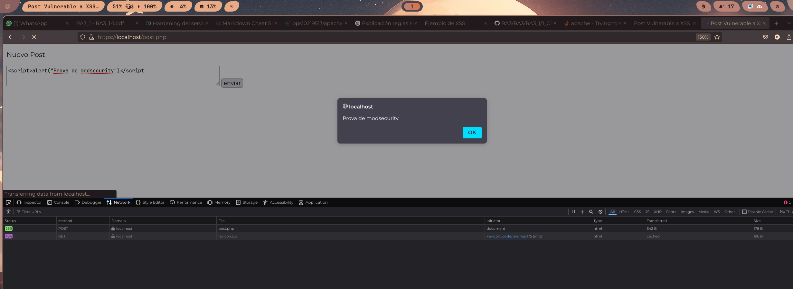
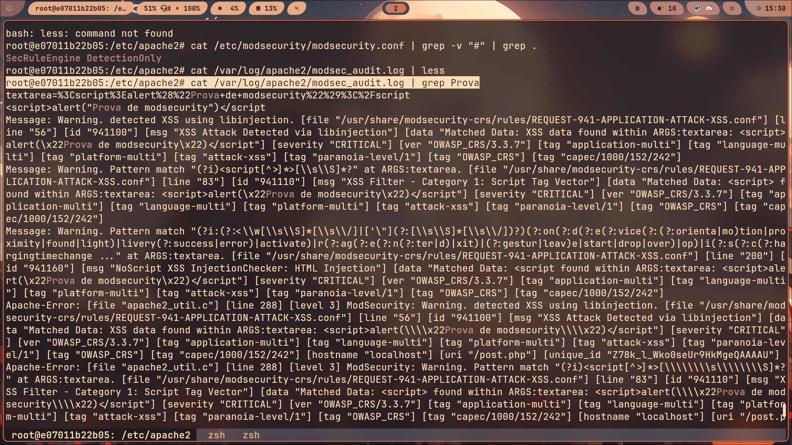

# WAF (web app firewall)
En aquest apartat de la pràctica i seguint la guía només anem a 
aplicar les regles per defecte.
El fitxer per defecte que obtenim al descarregar el paquet libapache2-mod-security2
**no bloqueja tràfic**, llavors generarem logs. Açò es pot comprobar en la primera línea del fitxer.

*/etc/modsecurity/modsecurity.conf*
```
SecRuleEngine DetectionOnly
```

Una vegada ha quedat clar que en aquest apartat només és detecten els atacs anem a comprobar-ho:

| Atac | Log|
| ----------- | ----------- |
| |   |


