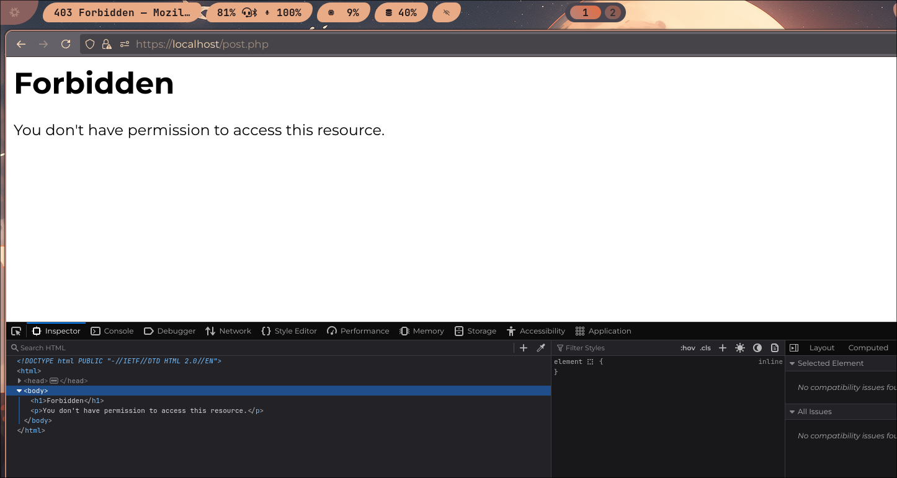

# Que són les regles OWASP?
Les regles OWASP de ModSecurity són un conjunt de directrius basades en el OWASP
Core Rule Set, dissenyades per detectar i bloquejar atacs comuns a aplicacions web.
Aquestes regles utilitzen patrons per identificar vulnerabilitats com
injeccions SQL i cross-site scripting analitzant el tràfic HTTP.

### Com s'apliquen?

S'ha de clonar aquest [repositori](https://github.com/SpiderLabs/owasp-modsecurity-crs.git)
però s'ha de tindre en compte que el repositori porta
des del 2020 archivat. 

|Regles aplicades | Atac | Resultat |
|--------- | ----------- | ----------- |
| - [  ] | |   |
| - [ :ballot_box_with_check: ] | |   |
