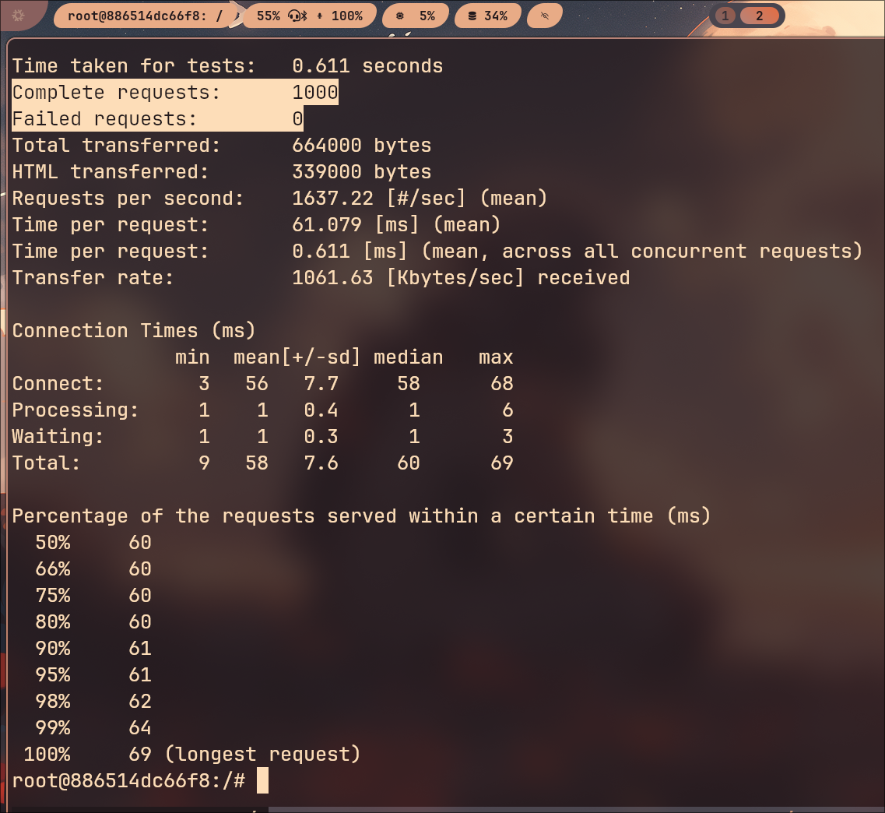
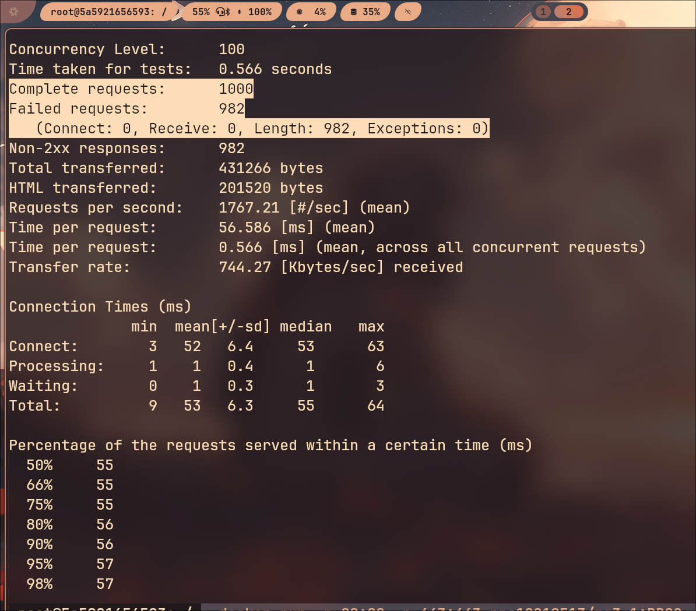

# Evitar DDOS
### Com és fa?
Activar el mòdul evasive de apache2

'''
RUN apt install -y libapache2-mod-evasive
RUN a2enmod evasive
'''
| Versió del contenidor | Atac | 
|--------- | ----------- |
| - [ OWASP ](https://hub.docker.com/layers/pps10219513/ra3.1/OWASP/images/sha256-c1ff14fa967e15d79ab19e6c550c6fad8cca9bbf46d81f9e1a6647d181b54e30) | |
| - [ DDOS ](https://hub.docker.com/layers/pps10219513/ra3.1/DDOS/images/sha256-26ad0e91819a6e9b7de17420a068d343ca81995ef11c109d8ed78abc699e8b10) | |
