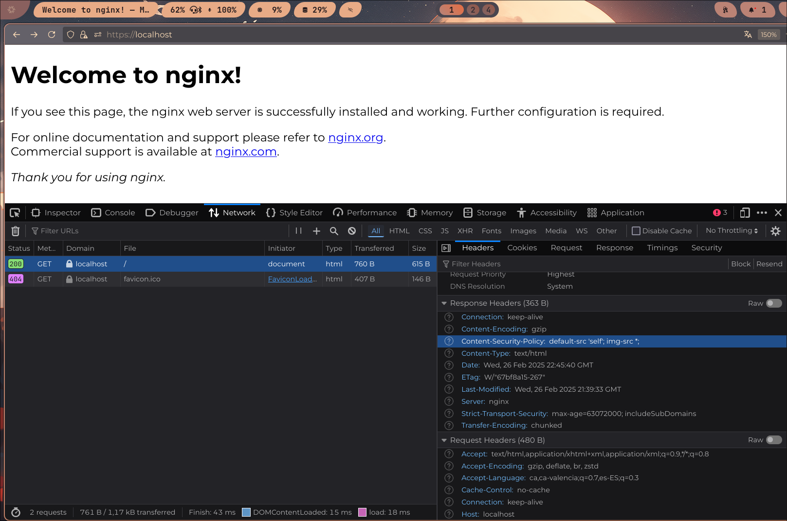

# Configuracions dutes a terme
---
#### Llevar la versió de nginx i sistema operatiu (a les capçaleres i als missatges d'error)
*/etc/nginx/nginx.conf*
``` 
http {
    ...
	server_tokens off;
    ...
}
```
| Com era abans | Com és ara|
| ----------- | ----------- |
| |   |


#### També deshabilitarem l'autoindex per no poder llistar fitxers quan no hi ha un index.html
*/etc/nginx/sites-enabled/virtual-host.conf*
```
server {
    ...
	location / {
		autoindex off;
        ...
	}
}
```
| Com era abans | Com és ara|
| ----------- | ----------- |
| |   |


## HSTS
#### Que és?
HSTS és com se li denomina a l'estàndard de l'[IETF](https://ca.wikipedia.org/wiki/Internet_Engineering_Task_Force) 
especificat al [RFC 6797](https://datatracker.ietf.org/doc/html/rfc6797)

Aquest estàndard introdueix una **capçalera** que li diu als **navegadors**
que **recorden** que aquest domini i/o subdominis tenen https i vagen directament 
a la versió amb **[encriptació](https://en.wikipedia.org/wiki/Transport_Layer_Security)** durant un periode de temps definit

*/etc/nginx/sites-enabled/virtual-host-ssl.conf*
```
server {
    ...
    add_header Strict-Transport-Security "max-age=63072000; includeSubDomains" always;
}
```
| Com era abans | Com és ara|
| ----------- | ----------- |
| |   |

---

# CSP
### Que és?
Una capa de seguretat que ajuda a previndre
i mitigar certs tipus d'atacs com:
- XSS
- Injecció de dades


## Com s'aconsegueix
Mijançant les capçaleres del protocol http. Aquest estàndar afegeix la capçalera
"Content-Security-Policy" on s'especifica d'on es poden carregar els recursos.

*/etc/nginx/sites-enabled/virtual-host.conf*
```
server {
    ...
    add_header Content-Security-Policy "default-src 'self'; img-src *; media-src media1.com media2.com; script-src userscripts.example.com" always;
    ...
}
```

| Com era abans | Com és ara|
| ----------- | ----------- |
| |   |

### Bloqueig de DDOS
En ngix és pot diferenciar entre bloquetjar peticions rebudes per ip i/o conexions actives.
En aquest cas s'ha bloquetjat tant la cuantitat de peticions per ip com la cuantitat de conexions actives

*/etc/nginx/nginx.conf*
```
http {
    ...
    limit_req_zone $binary_remote_addr zone=req_limit_per_ip:10m rate=1r/s;
    limit_conn_zone $binary_remote_addr zone=conn_limit_per_ip:10m;
}
```
*/etc/nginx/sites-enabled/virtual-host.conf*
```
server {
    ...
    location / {
        ...
        limit_req zone=req_limit_per_ip burst=5;
        limit_conn conn_limit_per_ip 10;
    }
}
```

| Bloqueig de DDOS no actiu | Bloqueig de DDOS actiu|
| ----------- | ----------- |
| |   |

