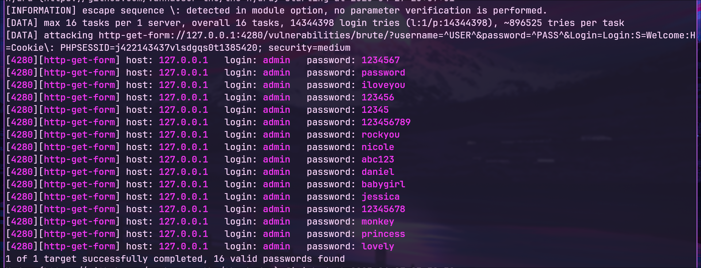

# 🚀 Resolución Brute Force 

Se ha usado la herramienta 🔥 **Hydra** para automatizar el ataque.  
La orden incluyó el uso del famoso diccionario **rockyou.txt**.  
La autenticación era mediante un formulario vulnerable disponible en la aplicación.  
Hydra gestionó múltiples tareas en paralelo para aumentar la velocidad ⚡.  
¡Logré obtener varias contraseñas válidas para el usuario `admin`! 🔑  
Entre las contraseñas encontradas están `123456`, `password`, `abc123` y más.  
El objetivo estaba alojado localmente (`127.0.0.1`) para propósitos de práctica 🖥️.  
Aquí puedes ver el resultado del ataque:  
  

