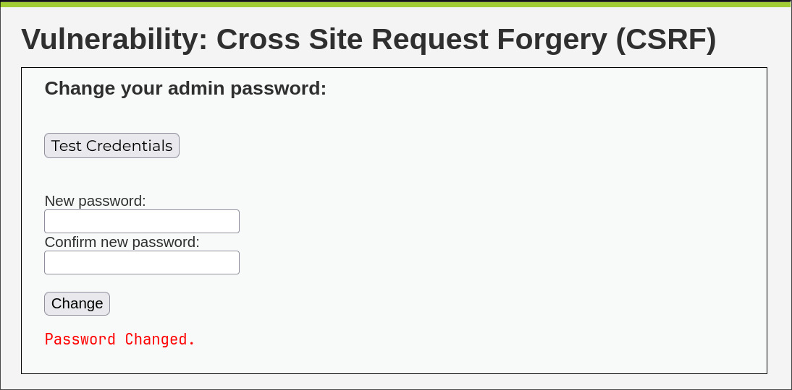

## :shield: :syringe: CSRF — Cross-Site Request Forgery

:link: **Tipo de ataque**: Explotación de la confianza del sitio en el navegador del usuario.

:smiling_imp: **¿Qué hace?**  
Un atacante engaña al usuario autenticado para que ejecute acciones no deseadas  
(enviar formularios, cambiar contraseñas, realizar transacciones, etc.)  
sin que el usuario lo sepa.

:dart: **¿Cómo funciona?**  
El atacante crea un enlace o carga un recurso malicioso en otra web  
que, al ser visitada por el usuario, envía una solicitud a la aplicación objetivo  
utilizando las cookies de sesión activas del usuario.

En el caso de la modalidad low DVWA no hace falta modificar nada
ya que en puedes cambiar contraseñas de usuarios sin conocer su contraseña actual.

