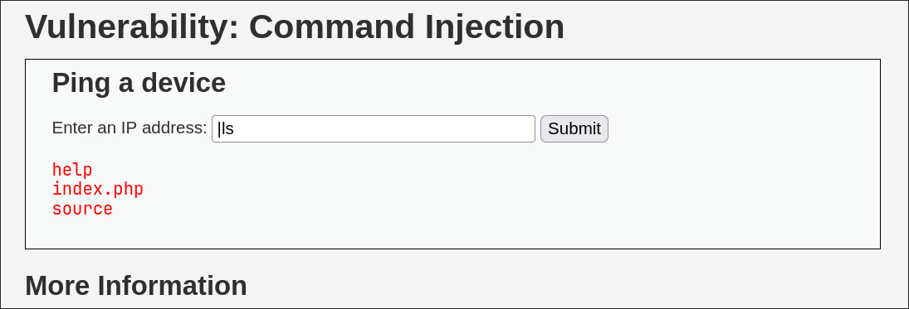

# :computer: Command Injection

:mag: **¿Qué es?**  
El **Command Injection** es una vulnerabilidad donde un atacante puede ejecutar comandos arbitrarios en el servidor a través de entradas no validadas.

:rotating_light: **¿Cómo sucede?**  
El servidor concatena directamente datos de usuario en comandos del sistema operativo sin sanitización, permitiendo la inyección maliciosa.

:shield: **Impacto**  
Puede resultar en robo de información, control del servidor o ejecución remota de comandos.

Para atacar utilizando esta vulnerabilidad, solo hemos de preceder el comando a ejecutar con `|`.

