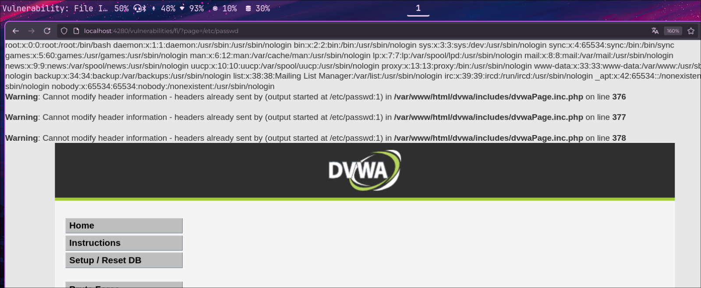

## :file_folder: :warning: File Inclusion — Inclusión de Archivos

:link: **Tipo de ataque**: Inyección que permite al atacante incluir archivos en el servidor web.

:smiling_imp: **¿Qué hace?**  
Permite al atacante cargar archivos locales o remotos  
que pueden ejecutar código malicioso o exponer información confidencial.

:dart: **¿Cómo funciona?**  
El atacante manipula una entrada del usuario (como una URL o parámetro)  
para que el servidor incluya un archivo arbitrario.  

Dependiendo del contexto, esto puede ser:  
- :page_facing_up: **LFI (Local File Inclusion)** — incluir archivos locales del sistema.  
- :globe_with_meridians: **RFI (Remote File Inclusion)** — incluir archivos remotos a través de una URL.

:hammer_and_wrench: **Ejemplo de URL vulnerable**  
```php
index.php?page=../../../../etc/passwd
```



