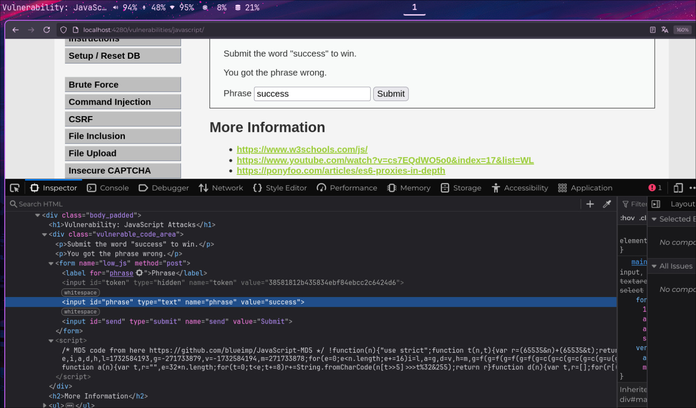
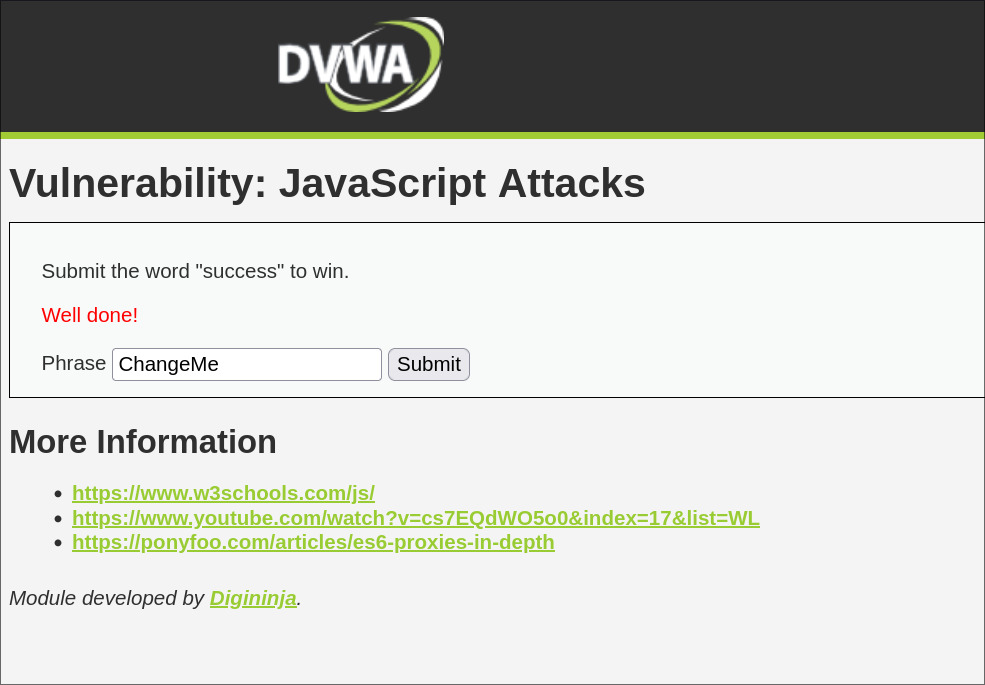

## :scroll: :mag: JavaScript — Exposición y Manipulación del Lado del Cliente

:link: **Tipo de ataque**: Inspección y modificación de código JavaScript ejecutado en el navegador.

:smiling_imp: **¿Qué hace?**  
Permite a un atacante ver, analizar y potencialmente modificar  
el comportamiento del código JavaScript que se ejecuta en el cliente.

:dart: **¿Cómo funciona?**  
El navegador del usuario descarga y ejecuta archivos JavaScript públicos.  
Estos scripts pueden contener información sensible (como claves API, lógica de seguridad o flujos internos)  
que un atacante puede inspeccionar desde las herramientas de desarrollo del navegador.

Además, como el entorno es controlado por el usuario, puede:  
- Reescribir funciones usando la consola (`override`)  
- Interceptar datos antes de que se envíen  
- Inyectar código con extensiones, proxies o bookmarks maliciosos

Ejemplos comunes incluyen:  
- Variables sensibles expuestas en scripts (`const SECRET_KEY = "..."`)  
- Validaciones de seguridad solo del lado cliente  
- Lógica de precios, descuentos o autenticación en el frontend  
- Manipulación de formularios o respuestas con JavaScript

:lock: **Objetivo del atacante**  
- Robar información confidencial del frontend (:file_folder:)  
- Eludir validaciones o restricciones (:running:)  
- Modificar comportamiento de la aplicación (:twisted_rightwards_arrows:)

:shield: **¿Cómo prevenirlo?**  
- Nunca confiar en la seguridad del lado cliente.  
- Validar y controlar todo en el servidor.  
- Minimizar, ofuscar y revisar el código JavaScript público.  
- Evitar incluir secretos o lógica crítica en el frontend.  
- Utilizar mecanismos seguros de autenticación y autorización en el backend.

---

### :framed_picture: Resolución del ejercicio

Observando el funcionamiento del formulario se puede
observar que se envian dos objetos un token y una cadena que nos pide.
Para crear el token se ejecuta la operación "rot13" sobre la cadena
que le enviamos y luego hace el md5 del resultado. md5(rot13(cadena_enviada_por_usuario).

### :framed_picture: Ejemplo visual

Para resolverlo solo  hay que enviar la cadena con el paramétro
correcto.
    - token=38581812b435834ebf84ebcc2c6424d6
    - phrase=success

