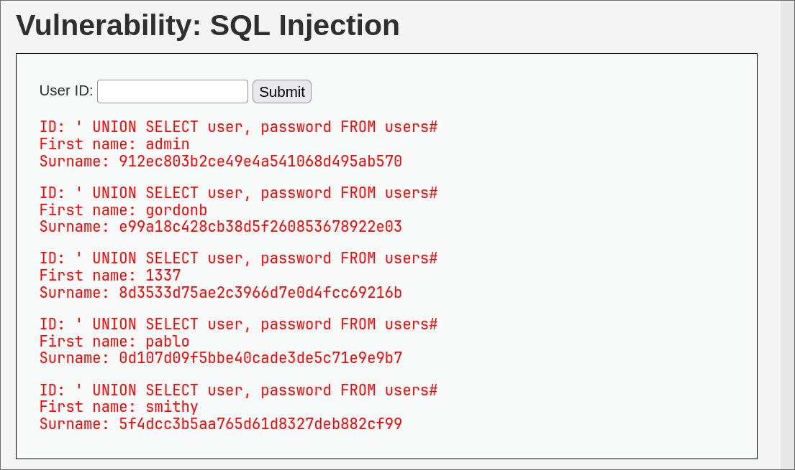

## :elephant: :boom: SQL Injection — Inyección de SQL

:link: **Tipo de ataque**: Manipulación de consultas SQL a través de entradas de usuario.

:smiling_imp: **¿Qué hace?**  
Permite a un atacante interferir con las consultas SQL que la aplicación hace a su base de datos.  
Esto puede llevar al robo, modificación o eliminación de datos.

:dart: **¿Cómo funciona?**  
El atacante inserta comandos SQL maliciosos en campos de entrada (como formularios o URLs)  
para alterar el comportamiento previsto de una consulta.

Ejemplos comunes incluyen:  
- `' OR '1'='1` para acceder sin contraseña.  
- `'; DROP TABLE users;--` para borrar tablas.  
- Inyecciones en parámetros de búsqueda para extraer datos confidenciales.

:lock: **Objetivo del atacante**  
- Acceder a información sensible (:card_index_dividers:)  
- Modificar o eliminar datos (:bomb:)  
- Tomar control de la base de datos (:detective:)

:shield: **¿Cómo prevenirlo?**  
- Usar consultas **preparadas (prepared statements)** o **ORMs** seguros.  
- Validar y sanear todas las entradas del usuario.  
- Nunca concatenar datos del usuario directamente en las consultas SQL.  
- Usar privilegios mínimos en las cuentas de base de datos.

---

### :framed_picture: Ejemplo visual del primer ejercicio

*' UNION SELECT user, password FROM users#*

