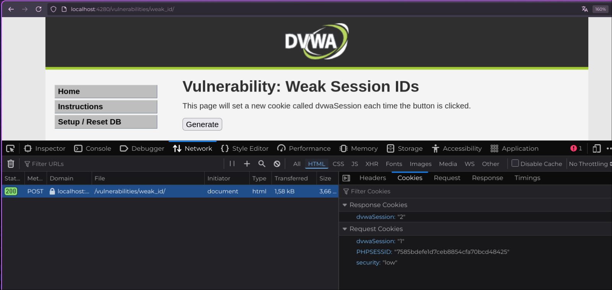

## :cookie: :warning: Weak Session IDs — Identificadores de Sesión Débiles

:link: **Tipo de ataque**: Suplantación de sesión por predicción de identificadores.

:smiling_imp: **¿Qué hace?**  
Permite a un atacante adivinar o calcular el ID de sesión de otros usuarios,  
tomando el control de sus cuentas sin necesidad de credenciales.

:dart: **¿Cómo funciona?**  
La aplicación asigna IDs de sesión predecibles, como valores numéricos secuenciales  
(`0`, `1`, `2`, ...).  
Un atacante inicia sesión, obtiene su propio ID (por ejemplo, `4`)  
y prueba sesiones anteriores o siguientes (`3`, `2`, etc.) para secuestrar cuentas activas.

Ejemplos comunes incluyen:  
- Cookies como `session_id=0`, `session_id=1`, etc.  
- Uso de contadores simples en lugar de identificadores aleatorios.  
- Falta de rotación de sesión tras autenticación.

:lock: **Objetivo del atacante**  
- Suplantar la identidad de otros usuarios (:busts_in_silhouette:)  
- Acceder a información privada (:lock_with_ink_pen:)  
- Tomar control de cuentas privilegiadas (:crown:)

:shield: **¿Cómo prevenirlo?**  
- Generar IDs de sesión **aleatorios y no predecibles** (usar UUIDs, tokens criptográficos, etc).  
- Usar bibliotecas de manejo de sesión confiables.  
- Rotar el ID de sesión tras iniciar sesión exitosamente.  
- Implementar detección y bloqueo de intentos sospechosos.

---

### :framed_picture: Ejemplo visual

