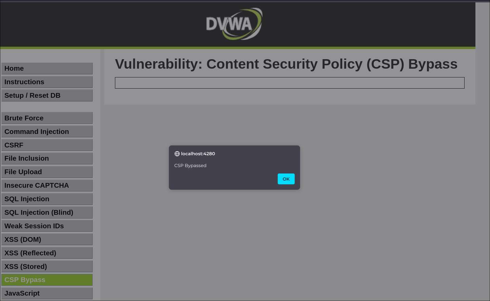

## :no_entry_sign: :boom: CSP Bypass — Evasión de Content Security Policy

:link: **Tipo de ataque**: Evasión de políticas de seguridad para ejecutar scripts maliciosos.

:smiling_imp: **¿Qué hace?**  
Permite a un atacante ejecutar código JavaScript malicioso  
a pesar de que exista una **Content Security Policy (CSP)** diseñada para prevenirlo.

:dart: **¿Cómo funciona?**  
Una CSP mal configurada puede permitir la carga de scripts externos o inline.  
El atacante encuentra una forma de usar recursos permitidos (como `JSONP`, `eval`, `data:` URIs o `trusted` CDNs)  
para ejecutar su código dentro del navegador de la víctima.

Ejemplos comunes incluyen:  
- Uso de `unsafe-inline` o `unsafe-eval` en la política.  
- Inclusión de dominios externos poco confiables en `script-src`.  
- Reutilización de endpoints JSONP o funciones callback vulnerables.  
- Subida de archivos maliciosos a dominios permitidos.

:lock: **Objetivo del atacante**  
- Evadir protecciones contra XSS (:japanese_ogre:)  
- Ejecutar código arbitrario en el navegador (:boom:)  
- Robar información sensible (:spy:)

:shield: **¿Cómo prevenirlo?**  
- Evitar completamente `unsafe-inline` y `unsafe-eval`.  
- Restringir `script-src` a dominios estrictamente controlados.  
- Usar hashes (`sha256-...`) o nonces para scripts permitidos.  
- Revisar y auditar recursos externos incluidos en la CSP.  
- Probar activamente la política con herramientas como CSP Evaluator o scanners automatizados.

---

### :framed_picture: Resolución del ejercicio

Para resolver el ejercicio simplemente tenemos que tener un
script en remoto. En mi caso la url https://digi.ninja/dvwa/alert.js
contiene la cadena:'alert("CSP Bypassed");'

### :framed_picture: Ejemplo visual

