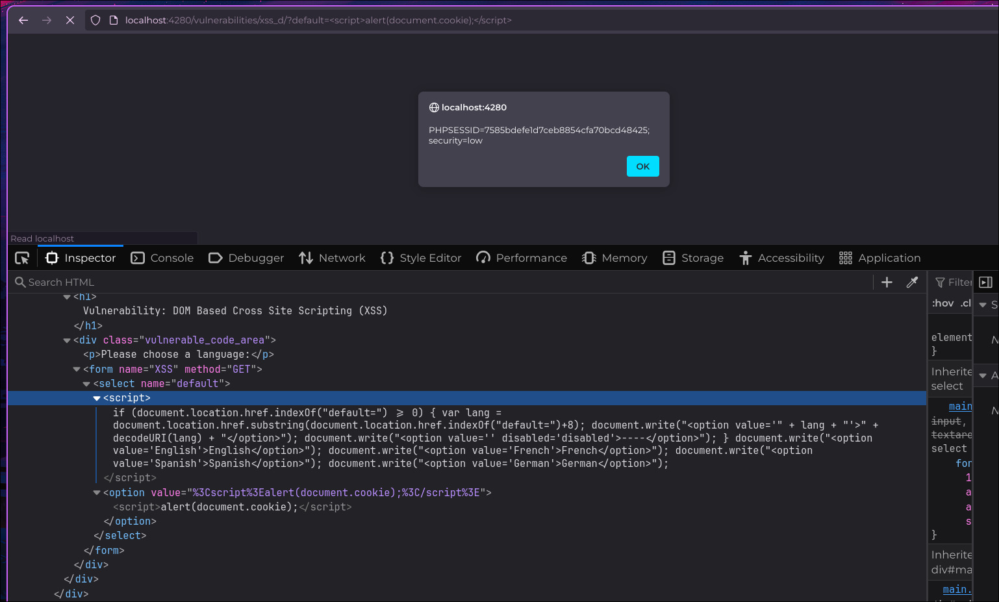

## :crystal_ball: :boom: DOM-Based XSS — Cross-Site Scripting basado en el DOM

:link: **Tipo de ataque**: Inyección de scripts maliciosos mediante manipulación del DOM en el navegador.

:smiling_imp: **¿Qué hace?**  
Permite a un atacante ejecutar JavaScript en el navegador de la víctima  
sin interacción con el servidor, explotando cómo el frontend procesa datos del usuario.

:dart: **¿Cómo funciona?**  
La aplicación lee datos inseguros desde `location`, `document`, `window` u otras fuentes,  
y los inserta directamente en el DOM sin sanitización.  
El atacante puede inyectar un payload en la URL que se ejecuta al cargar la página.

Ejemplos comunes incluyen:  
- `example.com#`  
- Uso inseguro de `innerHTML`, `document.write()`, etc.  
- Parámetros reflejados en el DOM sin escape (`location.search`, `location.hash`)

:lock: **Objetivo del atacante**  
- Robar cookies o tokens de sesión (:cookie:)  
- Registrar pulsaciones de teclado (:keyboard:)  
- Redirigir o suplantar interfaces (:performing_arts:)

:shield: **¿Cómo prevenirlo?**  
- Nunca insertar datos no confiables con `innerHTML` u otros métodos inseguros.  
- Usar funciones como `textContent` o librerías que sanear el HTML.  
- Validar y escapar datos antes de usarlos en el DOM.  
- Implementar **Content Security Policy (CSP)** para limitar scripts externos.

---

### :framed_picture: Ejemplo visual

**

