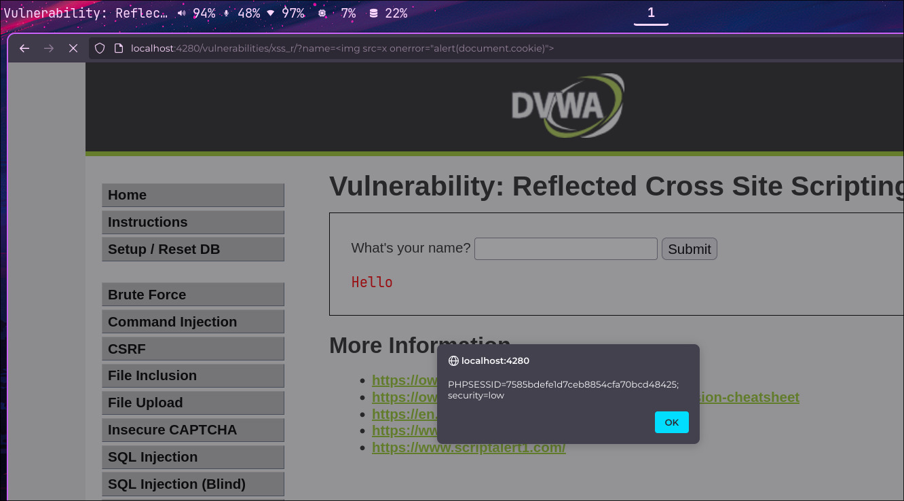

## :mirror: :boom: Reflected XSS — Cross-Site Scripting Reflejado

:link: **Tipo de ataque**: Inyección de scripts maliciosos a través de respuestas inmediatas del servidor.

:smiling_imp: **¿Qué hace?**  
Permite a un atacante ejecutar código JavaScript en el navegador de la víctima,  
reflejando el payload directamente desde la URL hacia la respuesta del servidor.

:dart: **¿Cómo funciona?**  
El atacante crea una URL con un script malicioso como parámetro.  
Cuando la víctima hace clic en el enlace, el servidor refleja el valor en la página  
sin validarlo ni sanearlo, y el script se ejecuta en el navegador.

Ejemplos comunes incluyen:  
- `example.com/search?q=`  
- Formularios que muestran directamente lo ingresado por el usuario  
- Parámetros de URL reflejados en HTML, sin escape

:lock: **Objetivo del atacante**  
- Robar información sensible (:cookie:)  
- Realizar ataques de phishing visual (:fish:)  
- Manipular la interfaz para engañar al usuario (:japanese_goblin:)

:shield: **¿Cómo prevenirlo?**  
- Escapar correctamente todos los datos reflejados en HTML, JS y atributos.  
- Usar frameworks con protección automática contra XSS.  
- Validar entradas y restringir caracteres peligrosos.  
- Implementar **Content Security Policy (CSP)** para mitigar impactos.

---

### :framed_picture: Ejemplo visual

