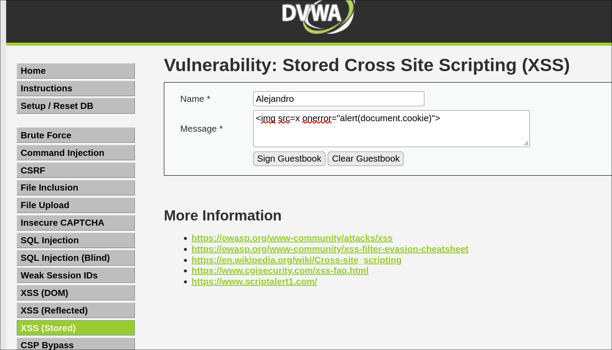

## :floppy_disk: :boom: Stored XSS — Cross-Site Scripting Almacenado

:link: **Tipo de ataque**: Inyección de scripts maliciosos que se guardan en el servidor y se entregan a múltiples usuarios.

:smiling_imp: **¿Qué hace?**  
Permite a un atacante guardar código JavaScript malicioso en el servidor (por ejemplo, en comentarios o perfiles)  
que se ejecutará cada vez que otro usuario cargue esa información.

:dart: **¿Cómo funciona?**  
El atacante envía un payload a través de un formulario o API (por ejemplo, ``).  
Ese valor se almacena en una base de datos y luego se muestra en páginas visitadas por otros usuarios,  
donde el script se ejecuta en sus navegadores.

Ejemplos comunes incluyen:  
- Comentarios, nombres de usuario o publicaciones que contienen scripts.  
- Mensajes en foros o chats sin sanitización.  
- Campos de perfil con HTML inseguro.

:lock: **Objetivo del atacante**  
- Robar sesiones y datos de usuarios (:cookie:)  
- Difundir malware o redirecciones maliciosas (:link:)  
- Tomar control de cuentas administrativas (:crown:)

:shield: **¿Cómo prevenirlo?**  
- Escapar y sanitizar todo contenido antes de mostrarlo.  
- Rechazar etiquetas HTML y scripts no permitidos.  
- Usar frameworks que previenen XSS por defecto.  
- Implementar **Content Security Policy (CSP)** para limitar ejecución de scripts.

---

### :framed_picture: Ejemplo visual

