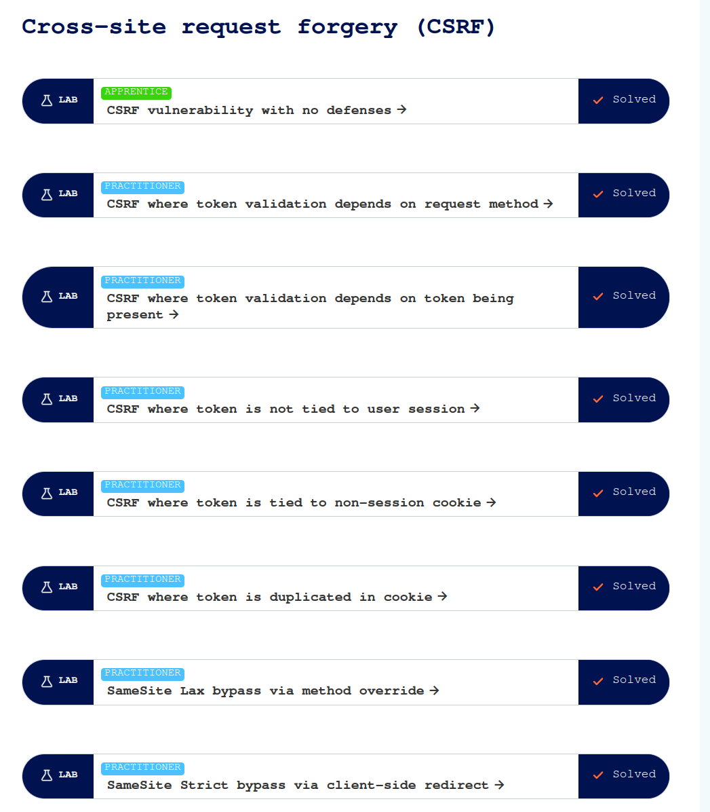
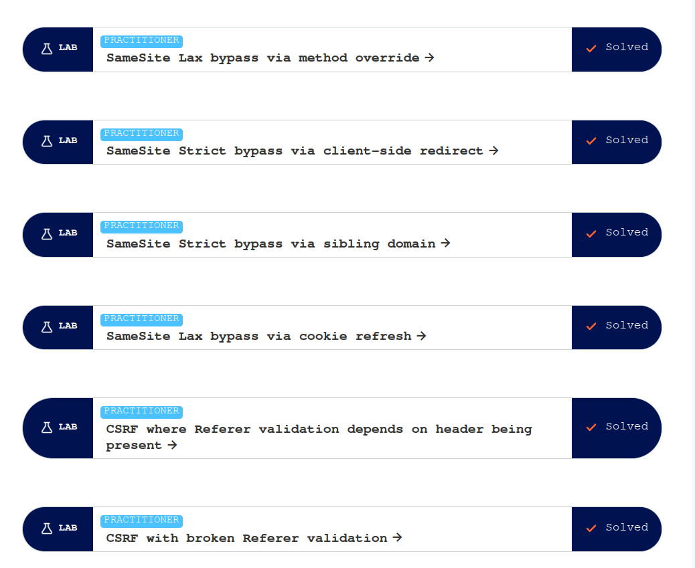
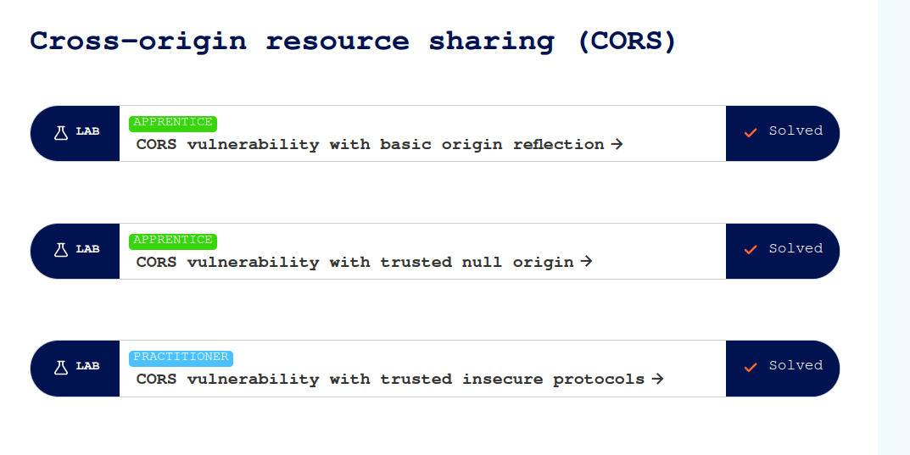
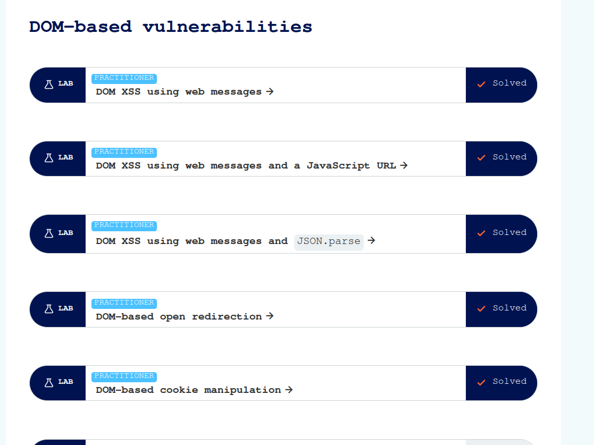
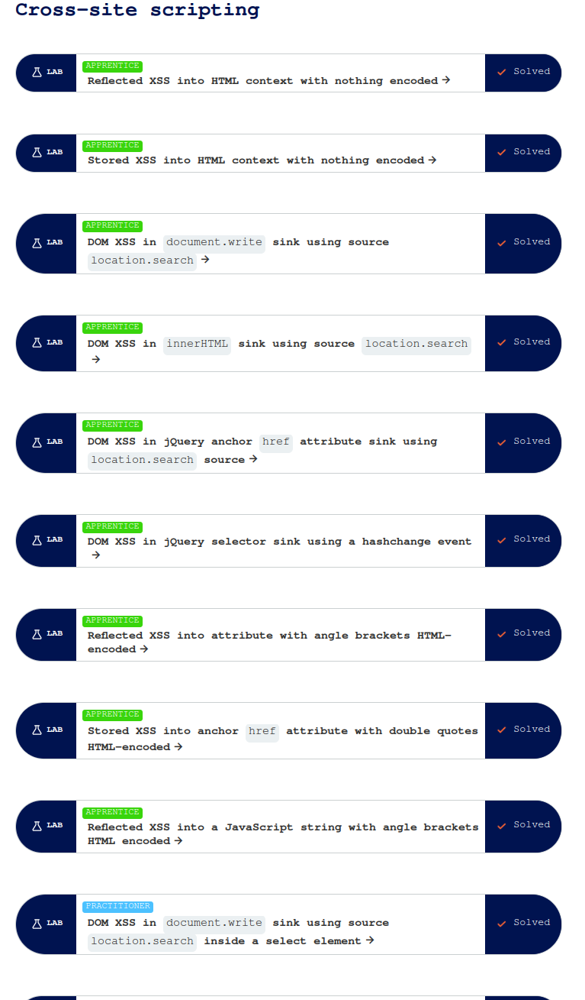
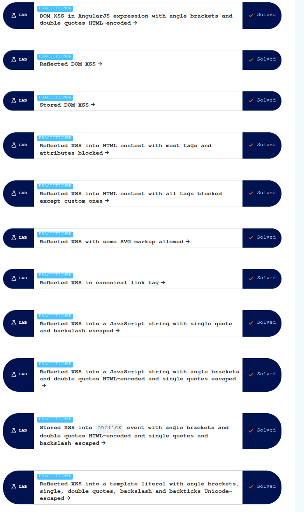
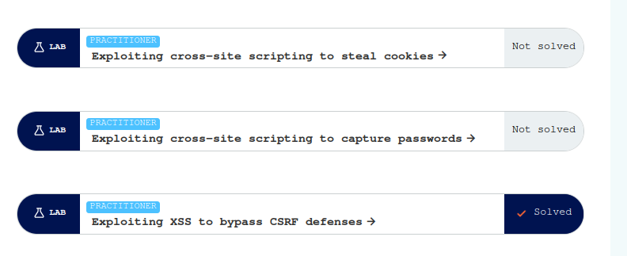

## Cross-site request forgery (CSRF)

 CSRF es un tipo de ataque en el que un atacante engaña al usuario autenticado para que ejecute acciones no deseadas en una aplicación web en la que tiene sesión activa.

## Cross-origin resource sharing (CORS)

CORS es un mecanismo de seguridad del navegador que permite o restringe las solicitudes HTTP entre diferentes dominios.
Por defecto, un navegador restringe estas solicitudes para evitar riesgos de seguridad. CORS permite especificar qué dominios pueden acceder a los recursos de un servidor.

## Document Object model (DOM)

El DOM es una representación estructurada de un documento HTML o XML en forma de árbol. Permite a los
lenguajes de programación (como JavaScript) acceder y manipular el contenido, la estructura y el estilo de la página.

## Cross-site scripting (XSS)

XSS es una vulnerabilidad que permite a un atacante inyectar código malicioso (generalmente JavaScript) en un sitio web que luego es ejecutado por el navegador de otro usuario.

