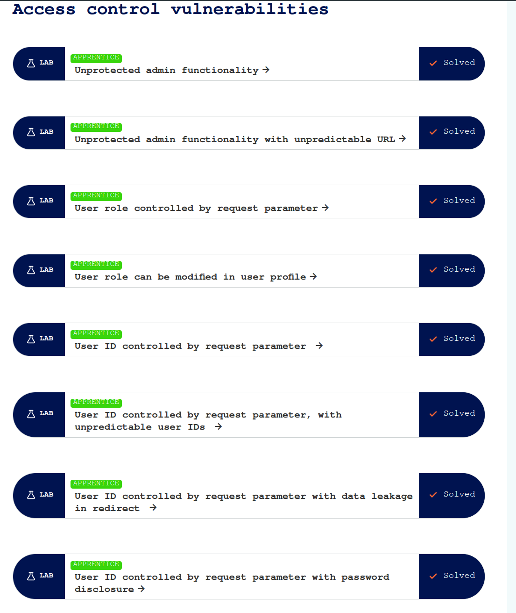

## Path Traversal

Manipulación de rutas para acceder a archivos sensibles fuera del directorio permitido, comprometiendo la seguridad del sistema.

## OS command injection

Ejecución de comandos del sistema operativo a través de entradas no controladas, permitiendo acceso total al servidor.

## Information disclousure

Exposición no autorizada de información sensible, como datos de usuario, configuraciones o versiones del software.

## File upload

Subida de archivos maliciosos que pueden ejecutar código, obtener acceso no autorizado o manipular datos del servidor.

## SSRF

Servidor manipulado para realizar solicitudes HTTP hacia recursos internos, potencialmente accediendo a información privada o servicios internos.

## API-Testing

Evaluación de APIs para identificar vulnerabilidades en autenticación, autorización, validación de datos y exposición de información sensible.

## Access control

Restricción de permisos para prevenir accesos no autorizados a recursos críticos o sensibles del sistema.

